# ⛩ DOJO SIGNER

**Real BIP47 PayNym + MuSig2 3-of-3 Vault + Whirlpool coinjoin signing on the Foundation Passport Prime**

DOJO SIGNER is a [KeyOS](https://docs.foundation.xyz/) app for the [Foundation Passport Prime](https://foundation.xyz/) that turns your trusted hardware device into:

- A **real BIP47 PayNym identity generator** — payment code, notification address, and ECDH payment addresses derived from the device seed
- A **real BIP47 message verifier** — recovers the signer's public key from the signature and checks it against the payment code's notification key
- A **MuSig2 (BIP-327) 3-of-3 vault** — three Passport Primes aggregate into ONE payment-code identity ("the savings vault") with QR-only 4-round signing. No single device ever holds the vault's key
- A **Whirlpool coinjoin signing device** — parses real PSBTs from a companion app over Quantum Link BLE, lets you review inputs on the secure display, and signs with the secure element
- A **UTXO coin control console** — real balance and unspent outputs from the wallet

Every cryptographic derivation in this app is verified byte-for-byte against the **official Samourai BIP47 test vectors** and the **official `bitcoin/bips` BIP-327 test vectors** (see [Testing](#-testing)).

---

## 🎬 Preview

**MuSig2 Vault — full 4-round spend (screen recording):**

<p align="center">
  
</p>

**Vault screenshots** (captured in the KeyOS hosted simulator):

| Screen | Capture |
|--------|---------|
| **Home** — the new VAULT tile on the app home | 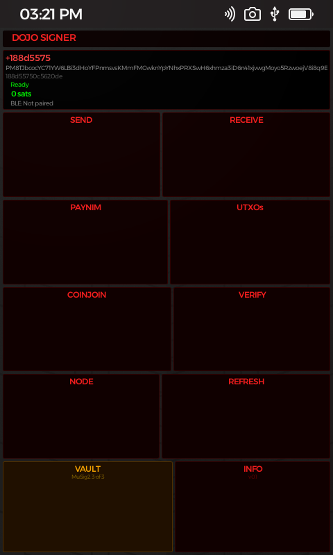 |
| **Vault Receive** — notification address + deterministic receive address + QR from the aggregate payment code | 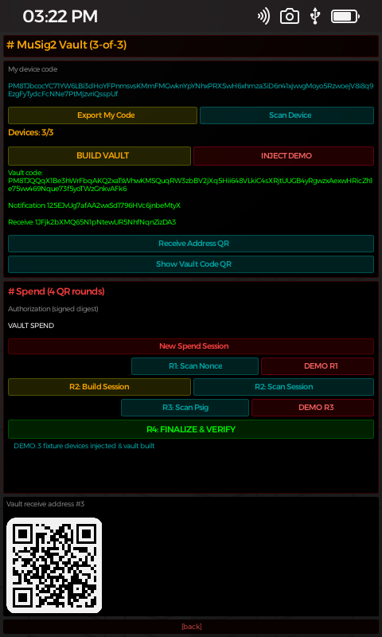 |

**Full app walkthrough (screen recording):**

<p align="center">
  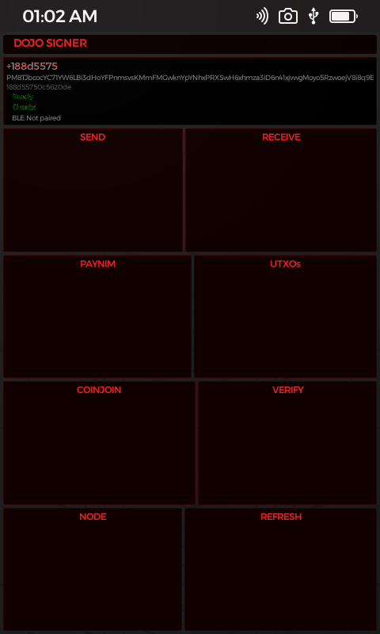
</p>

**Screenshots** (captured in the KeyOS hosted simulator):

| Screen | Capture |
|--------|---------|
| **Home** — PayNym identity + balance | 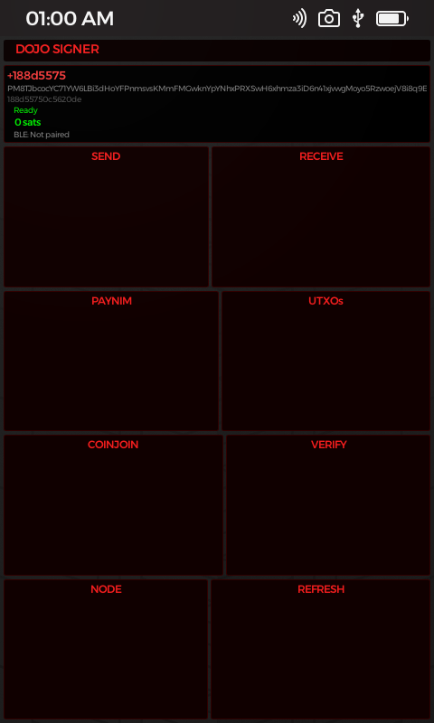 |
| **PayNym** — payment code + notification address | 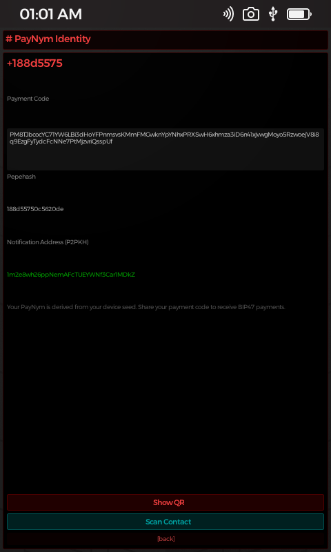 |
| **Send** — BIP47 / on-chain | 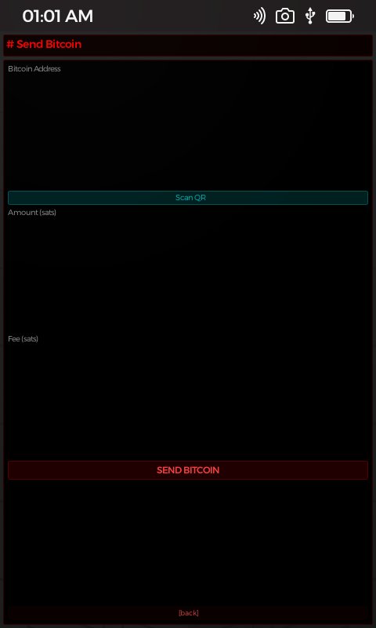 |
| **Receive** — real BIP84 address + QR | 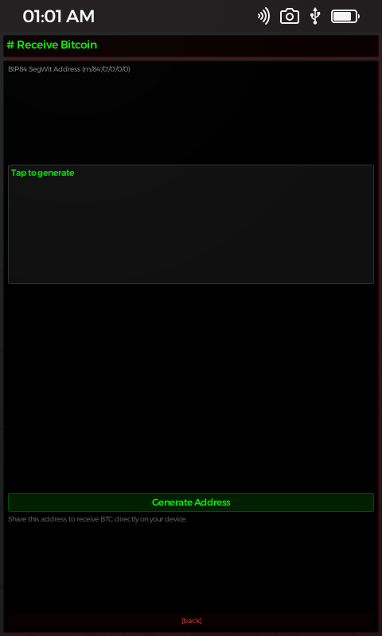 |
| **Settings** — node config + BLE | 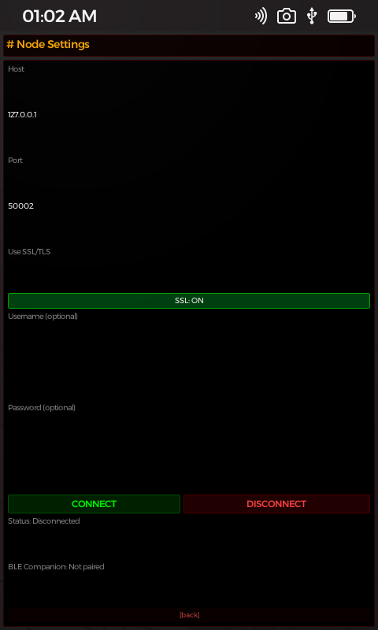 |
| **UTXO** — coin control | 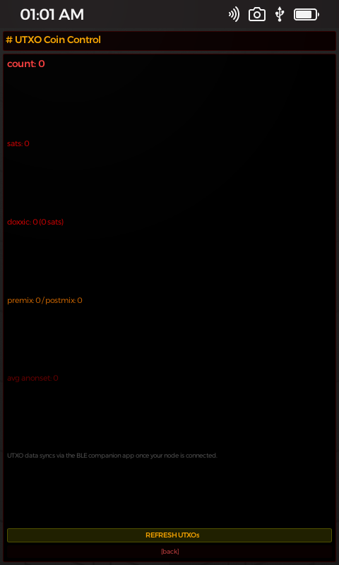 |
| **Coinjoin** — Whirlpool signing + pool selection | 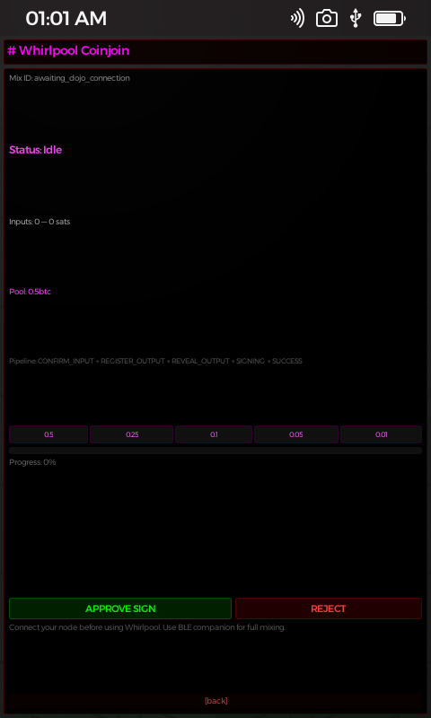 |
| **Verify** — BIP47 message verifier + history | 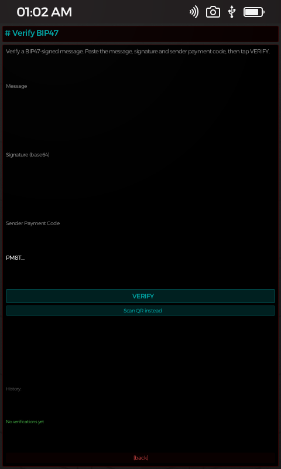 |

> These are raw simulator captures — no device frames, as requested.

---

## 🖥️ Interface

Terminal-styled secure display — black background, red monospace text:

```
  >> DOJO_SIGNER
  $ 🟢 Ready — PayNym: +ozarumoto, PC: PM8T...

  # PayNym Identity
  +----------------------------------+
  | 🐸 name: +ozarumoto              |
  |    notification: 1xxxxx...       |
  |    PM8T...code...                |
  | [show_code] [scan_qr] [refresh]  |
  +----------------------------------+

  [vault]  [utxo]   [coinjoin] [verify]
  [send]   [receive]            [settings]
```

---

## ✨ What It Does (100% real — no mock data)

### 🆔 BIP47 PayNym on Hardware
- Payment code derived from the **device seed** at `m/47'/0'/0'` — the seed **never leaves the device**
- Full base58check encoding with checksum validation (`PaymentCode::parse` rejects garbage input)
- **Notification address** (P2PKH of child index 0) — shown on the PayNym page
- Real **BIP47 payment addresses** via ECDH: `S = a·B`, `s = SHA256(Sx_raw)`, `B' = B + sG` — with index bumping on invalid scalars per the spec
- PayNym QR export + QR scanning for contacts
- Identity persisted and restored on launch

### ✉️ BIP47 Send (built & signed on-device)
- Paste a `PM8T...` payment code → app detects first contact automatically
- Builds + signs the **notification transaction**: blinded OP_RETURN (`HMAC-SHA512(outpoint, x)` XOR blinding) + dust to the notification address
- Then builds + signs the payment to the ECDH-derived address
- **Double-spend protection**: the payment tx marks the notification's input `unspendable`, so the two can never collide
- **Stranded-funds protection**: if the notification tx can't be built, the payment is skipped with a clear message
- Per-recipient BIP47 index persisted only on success → failed sends re-derive the same address
- *Broadcasting the signed tx on-chain requires a connected Electrum node — see the roadmap.*

### ✅ BIP47 Message Verifier
- Paste or scan a message + base64 signature + sender payment code
- Reconstructs the signer's **notification key** (`child_pubkey(0)`)
- Recovers the public key from the signature (`MessageSignature::from_base64` + `recover_pubkey`)
- **✅ Verified ✓** only when the recovered key **actually matches** the notification key — no fake "verified"
- Real timestamps, verification history persisted to AppData and shown on the Verify page

### 🏦 MuSig2 Vault — 3-of-3 (BIP-327)

The headline feature: **three Passport Primes cooperate to form ONE aggregate payment code** — a normal-looking `PM8T...` identity — whose signing key is the MuSig2 (BIP-327) aggregate of all three. Think of it as a **high-security savings account**: the vault is a single payment-code identity on the outside (great privacy), but no single device ever holds its key. Spending requires all three to sign together.

#### Why MuSig2 instead of a traditional multisig?
- **One aggregate key.** The vault gets a *single* public key, so it works anywhere a normal key works — BIP47 ECDH included. A legacy 3-of-3 multisig (P2SH/descriptor) is a visibly different address type and can't serve as a BIP47 payment-code identity.
- **One signature.** A MuSig2 spend produces a single 64-byte BIP340 signature that looks exactly like a normal single-sig taproot spend — indistinguishable on-chain (no script pubkeys, no `OP_CHECKMULTISIG`).
- **No device holds the vault key.** The aggregate private key never exists anywhere. The three devices only hold their own keys, so a single compromised device is worthless to an attacker.

#### The vault lifecycle
```
  SETUP    every device exports its BIP47 payment code (PM8T...)
           any device scans all N codes → aggregate payment code
           EVERY device recomputes the SAME vault from the shared codes
           (order-independent: the aggregate sorts keys per BIP-327)

  RECEIVE  the aggregate payment code + notification address are shown
           as a QR; senders pay the vault like any BIP47 identity
           Receive addresses: deterministic BIP32 children of the
           aggregate key (index 0 = the notification address)

  SPEND    4 QR rounds produce a single BIP340 signature:
           R1  each device exports a pubnonce
           R2  the coordinator combines them → session (aggnonce)
           R3  each device exports a partial signature
           R4  the coordinator aggregates → 64-byte signature, verified
               on-device against the vault's BIP47 child key
```

#### The 4 QR spend rounds (exactly what the Vault page shows)
| Round | Tap | What crosses the camera |
|-------|-----|------------------------|
| Setup | **📷 Export My Code** / **📷 Scan Device** | BIP47 payment codes (`DOJOV1\|SETUP\|...`) |
| — | **🔨 BUILD VAULT** | (no QR — local computation of the aggregate) |
| Receive | **📷 Receive Address QR** / **📷 Show Vault Code QR** | next receive address / the aggregate code |
| R1 | **R1: My Nonce** + **R1: Scan Nonce** | each device's 66-byte pubnonce (`NONCE`) |
| R2 | **R2: Build Session** + **R2: Scan Session** | the session broadcast: msg + index + aggnonce (`SESSION`) |
| R3 | **R3: Sign** + **R3: Scan Psig** | each device's 32-byte partial signature (`PSIG`) |
| R4 | **R4: FINALIZE & VERIFY** | (no QR — on-device aggregation + BIP340 verification) |

Every step is real crypto with real checks:
- `partial_sig_verify` (the BIP-327 check) rejects any tampered or wrong-session partial — a corrupted signature can **never** produce a final signature (covered by the `tampered_partial_signature_fails_finalize` test)
- R4 verifies the final 64-byte signature against the **child key of the aggregate payment code** — the exact key the receive addresses spend from
- The session signs a 32-byte spend-authorization digest (`VAULT SPEND` by default; in production this is the BIP341 sighash of the actual transaction)

#### Address-reuse protection
Receive addresses are deterministic per BIP47 child index, so the app persists a `vault_receive_index` counter and **bumps it before displaying** — after a reboot it can never re-offer an address that was already shown. Index 0 is the notification address by construction (asserted in tests).

#### Demo mode for the hosted simulator
The hosted simulator is a single device, but a 3-of-3 vault needs three. Setting `KEYOS_DEMO_VAULT=1` at launch exposes a **gated "🧪 INJECT DEMO"** button on the Vault page (never reachable in a shipped build unless the env var is set). It injects three deterministic fixture payment codes so the full build → receive → spend flow can be exercised, screenshotted and filmed on one screen — including fabricated fixture signers for R1/R3 so R4 **genuinely verifies** on-device (proven by the `demo_fabricated_four_round_spend_verifies` test).

### 🌀 Whirlpool Coinjoin Signing (over Quantum Link BLE)
Real `SigningRequest` handling — the protocol types come from the actual Ashigaru source:

```
1. REGISTER_INPUT   →  real pool selection (0.5/0.25/0.1/0.05/0.01 BTC) + real input outpoint
2. CONFIRM_INPUT    →  real mix_id + transaction payload
3. REVEAL_OUTPUT    →  real derived receive address
4. SIGNING          →  🔐 REVIEW ON SECURE DISPLAY 🔐
                       - Real PSBT parsed: inputs, values, witnesses
                       - Approve → device signs → returns real witnesses_64
                       - Reject → nothing leaves the device
5. SUCCESS / FAIL   →  broadcast via Quantum Link (PublishPsbt)
```

- Incoming PSBTs are parsed into **real UTXO entries** (outpoint txid:vout + `witness_utxo` value)
- `transaction_64` / `witnesses_64` are real base64 of the serialized unsigned tx + witnesses
- Coinjoin page shows **real input count + total sats** from the parsed PSBT
- BLE companion status + pairing events shown in Settings

### 🪙 UTXO Coin Control
- Real balance from `bdk_wallet` (`list_unspent`)
- Total count, total value, doxxic count, premix/postmix counts, average anonset
- Displayed in BTC or sats

### 🔗 Node Connection
- Electrum server settings: **host, port, SSL, username, password**
- Persisted to AppData and auto-restored on launch

---

## 🏗 Architecture

### How It Works

```
  Dojo/Companion app                     Passport Prime (DOJO SIGNER)
  ───────────────────                    ─────────────────────────────
       │  SubscribeSignPsbt                    │
       │  ── PSBT (real bytes) ──────────────► │  Parse → real inputs/values
       │                                       │  Review on secure display
       │                                       │  Approve → sign with SE
       │  PublishPsbt (broadcast)              │
       │  ◄── signed PSBT ───────────────────  │
       │                                       │
  Mix completes                          Seed NEVER leaves

  Vault spend (3 Passport Primes, QR-only — no network needed):
       Device A ── pubnonce ──► Device B (coordinator) ── session ──► C
       Device C ── psig ──────► Device B ── psig from A ──► aggregate
       B finalizes → 64-byte BIP340 sig, verified vs vault child key
```

### Project Structure

```text
dojo-signer/
├── manifest.toml           # App identity, permissions (security, quantum-link, fs)
├── Cargo.toml              # Rust dependencies (ngwallet, quantum-link, slint-keyos-platform)
├── build.rs                # Slint UI compiler integration
├── README.md               # This file
├── docs/screenshots/       # Simulator captures (this release's SPENDING.gif + vault PNGs)
├── src/
│   ├── main.rs             # Entry point + app wiring (2,148 lines)
│   ├── bip47.rs            # BIP47 payment codes, ECDH payment addresses, notification tx (504 lines)
│   ├── musig.rs            # BIP-327 MuSig2 primitives — key agg, nonce, partial sigs (1,446 lines)
│   ├── vault.rs            # 3-of-3 vault app layer — config, QR codec, 4-round spend (963 lines)
│   ├── coinjoin.rs         # Whirlpool protocol types (v0.23) + base64 helpers
│   ├── message.rs          # BIP47 message verifier types + history
│   └── utxo.rs             # UTXO coin control types
└── ui/
    ├── app.slint                        # Root window
    ├── dojo-signer-callbacks.slint      # Global callback/property bindings (vault callbacks included)
    ├── dojo-signer-types.slint          # PayNymView / UtxoSummaryView structs
    ├── gen/                             # Generated router/navigation (vault page registered)
    └── pages/                           # 9 screens
        ├── home/         # Identity card + navigation (VAULT tile)
        ├── paynym/       # Full payment code + notification address + QR
        ├── send/         # On-chain + BIP47 send
        ├── receive/      # Real BIP84 receive address + QR
        ├── settings/     # Node config + BLE companion status
        ├── utxo/         # Coin control summary
        ├── coinjoin/     # Whirlpool review + pool selection
        ├── verify/       # BIP47 message verifier + history
        └── vault/        # MuSig2 3-of-3 vault — build, receive, 4-round spend
```

### Real Crypto (src/bip47.rs)

| Derivation | Implementation |
|---|---|
| Payment code | `base58check(0x47 ∥ version ∥ pubkey ∥ chaincode ∥ padding)` from `m/47'/0'/0'` |
| Notification address | P2PKH of `child_pubkey(0)` (BIP32 non-hardened public derivation) |
| Payment address | `S = a·B`, `s = SHA256(Sx_raw)`, `B' = B + sG` → P2PKH(B') |
| Notification blinding | `s = HMAC-SHA512(outpoint, x)`; `x' = x ⊕ s[0..32]`, `c' = c ⊕ s[32..64]` |

> **Why raw x-coordinate?** `secp256k1`'s `SharedSecret::new()` SHA256-hashes the ECDH x-coordinate by default. BIP47 requires the *raw* x for both payment derivation (`s = SHA256(Sx)`) and notification blinding (`HMAC(outpoint, x)`). The app computes the raw x directly via `PublicKey::mul_tweak` + `x_only_public_key` — this exact bug was caught by the unit tests.

### Real Crypto (src/musig.rs + src/vault.rs)

| BIP-327 primitive | Implementation |
|---|---|
| Key aggregation | `key_agg_sorted` / `key_sort` — sorted pubkeys, `L = H(P1..Pn)`, tweaks per spec |
| Aggregate payment code | MuSig2 aggregate pubkey + chaincode combine → ONE `PM8T...` code |
| Nonces | `nonce_gen` (BIP-327 `NonceGen`) — 66-byte pubnonce, secret never leaves the device |
| Nonce aggregation | `nonce_agg` (BIP-327 `NonceAgg`) — 66-byte aggnonce for the session |
| Signing | `sign` (BIP-327 `Sign`) — 32-byte partial signatures |
| Verification | `partial_sig_verify` (BIP-327 `PartialSigVerify`) — tamper-proof |
| Aggregation | `partial_sig_agg` (BIP-327 `PartialSigAgg`) → 64-byte BIP340 signature |
| Child spend | plain tweak `IL` of the aggregate key (BIP32) — spend the vault's receive addresses |
| QR transport | versioned `DOJOV1\|TYPE\|...` hex payloads — Setup / Vault / Nonce / Session / Psig |

---

## ✅ Testing

The crypto is locked to the **official Samourai BIP47 test vectors** (gist.github.com/SamouraiDev/6aad669604c5930864bd) **and** the **official `bitcoin/bips` BIP-327 vectors** (`bip-0327/vectors.json` — key agg, nonce gen, nonce agg, sign, tweaks, error cases):

```bash
cd ~/KeyOS && cargo test -p gui-app-dojo-signer --profile hosted
```

```text
running 29 tests
  bip47  (8): base58check_roundtrip, blinding_mask_matches_samourai,
              child_pubkey_matches_samourai, notification_shared_secret_matches_samourai,
              payment_address_matches_samourai, payment_code_parse_samourai,
              identity_secret_pubkey_matches_payment_code_key,
              receive_address_index0_is_notification_address
  musig (13): key_agg_matches_official_bip327_vectors, key_agg_sorted_is_order_independent,
              key_agg_rejects_invalid_pubkeys, nonce_gen_matches_official_bip327_vectors,
              nonce_agg_matches_official_bip327_vectors, sign_matches_official_bip327_vectors,
              sign_with_tweaks_matches_official_vectors, sign_error_cases_match_official_vectors,
              aggregate_payment_code_is_deterministic_and_parses,
              threshold_ecdh_recovers_sender_side_secret,
              recipient_recovers_payment_address_via_threshold_ecdh,
              three_devices_jointly_sign_and_verify,
              three_devices_sign_for_child_key_of_aggregate_payment_code
  vault  (8): vault_build_is_order_independent_and_parses, vault_rejects_too_few_devices,
              qr_codec_roundtrips_all_payloads, full_three_device_spend_via_qr_payloads,
              tampered_partial_signature_fails_finalize,
              receive_address_is_deterministic_and_rotates,
              demo_codes_match_fixture_and_build_a_vault,
              demo_fabricated_four_round_spend_verifies

test result: ok. 29 passed; 0 failed
```

These tests caught real bugs before they shipped — an ECDH double-hash in the payment-address derivation, and multiple BIP-327 conformance issues (nonce-gen vector mismatches, tweak-ordering) that were fixed until the primitives matched the official vectors byte-for-byte.

---

## 🚀 Getting Started

### Prerequisites
- [Nix](https://nixos.org/download) with flakes enabled
- `just` command runner (`cargo install just`)
- Git

### Build & Run (in the KeyOS simulator)

DOJO SIGNER is a KeyOS workspace app — it runs inside the KeyOS OS:

```bash
# 1. Clone KeyOS (the OS that runs on Passport Prime)
git clone https://github.com/Foundation-Devices/KeyOS.git ~/KeyOS
cd ~/KeyOS

# 2. Enter the Nix development environment
nix develop

# 3. Typecheck the app
cargo check -p gui-app-dojo-signer --profile hosted

# 4. Run the unit tests
cargo test -p gui-app-dojo-signer --profile hosted

# 5. Launch the full simulator (with DOJO SIGNER installed)
just sim

# 6. (Optional) Enable the gated vault demo for screenshots/recordings
KEYOS_DEMO_VAULT=1 just sim
```

The app source lives at `apps/gui-app-dojo-signer/` inside the KeyOS tree.

### On-device permissions (manifest.toml)

```text
os/security       → GetSeed, GetSeedFingerprint, GetDeviceId, GetRandom (vault nonces)
os/quantum-link   → SendAccountUpdate, PublishPsbt, SubscribeSignPsbt,
                    SubscribeAccountUpdate, SubscribeConnectionStatus,
                    SubscribePairingEvent
os/fs             → GetUserReadAccess, GetUserWriteAccess (config + history persistence)
```

---

## 📊 Screens

| # | Screen | Purpose |
|---|--------|---------|
| 0 | **Home** | PayNym identity card, balance, navigation (incl. VAULT tile) |
| 1 | **PayNym** | Full payment code, notification address, QR export |
| 2 | **Send** | BIP47 payment-code send / on-chain address entry — amount + fee (built & signed on-device) |
| 3 | **Receive** | Real BIP84 address + QR |
| 4 | **Settings** | Node host/port/SSL/credentials, BLE companion status |
| 5 | **UTXO** | Coin control — count, value, doxxic, anonset |
| 6 | **Coinjoin** | Whirlpool review — real inputs, pool selection, approve/reject |
| 7 | **Verify** | BIP47 message verifier + history |
| 8 | **Vault** | MuSig2 3-of-3 — device codes, build, notification + receive addresses + QR, 4-round spend with on-device verification |

---

## 🛡 Security Model

- **Seed NEVER leaves the Passport Prime** — keys stay in the secure element
- **The vault's aggregate key never exists anywhere** — three devices hold three independent keys; no single device (or attacker) can spend alone
- Only public keys, pubnonces, sessions and signed PSBTs/witnesses are exported over BLE or QR
- Every signing requires **physical approval** on the secure display — nothing auto-signs
- **R4 verifies on-device**: partial signatures are individually checked (tamper-proof), and the final BIP340 signature is verified against the vault's child key before it's ever shown
- Payment + notification inputs can never collide (unspendable marking)
- Failed sends never consume a BIP47 index, so addresses stay deterministic
- Vault receive addresses never repeat across reboots (persisted, bump-before-display counter)
- No hot wallet, no software key storage, no seed exposure

---

## 🗺 Roadmap

- [x] Real BIP47 payment codes + notification address + ECDH payment addresses
- [x] Real BIP47 send (notification tx + payment, double-spend safe)
- [x] Real BIP47 message verification (pubkey recovery + notification-key match)
- [x] **MuSig2 (BIP-327) 3-of-3 vault** — aggregate payment code, receive addresses + QR, 4-round QR spend, on-device verification
- [x] Vault crypto verified byte-for-byte against the official `bitcoin/bips` BIP-327 vectors
- [x] Whirlpool PSBT signing over Quantum Link BLE (real inputs/values/witnesses)
- [x] Pool selection + node config persistence + verification history
- [x] 29/29 unit tests (8 bip47 + 13 musig + 8 vault)
- [ ] Electrum `blockchain.transaction.broadcast` for live on-chain sends
- [ ] Vault spend against a real PSBT (BIP341 sighash) instead of the authorization digest
- [ ] End-to-end BLE round-trip test with the real companion app
- [ ] Real-hardware validation on three Passport Prime dev units

---

## 📜 License

GNU GPLv3 — open source, fork it, build on it.

---

## 🙏 Acknowledgments

- [Foundation Devices](https://foundation.xyz/) for the Passport Prime and KeyOS
- [Samurai Wallet](https://samouraiwallet.com/) / Ashigaru for Whirlpool coinjoin and the BIP47 test vectors
- [BIP-47](https://github.com/bitcoin/bips/blob/master/bip-0047.mediawiki) for reusable payment codes
- [BIP-327](https://github.com/bitcoin/bips/blob/master/bip-0327.mediawiki) for MuSig2 — by Pieter Wuille, Tim Ruffing, et al.
- [bdk](https://bitcoindevkit.org/) for the wallet engine

---

*Built with ⛩ by OZARU — real BIP47 + MuSig2 vault + Whirlpool signing on Passport Prime, verified against the official test vectors.*
